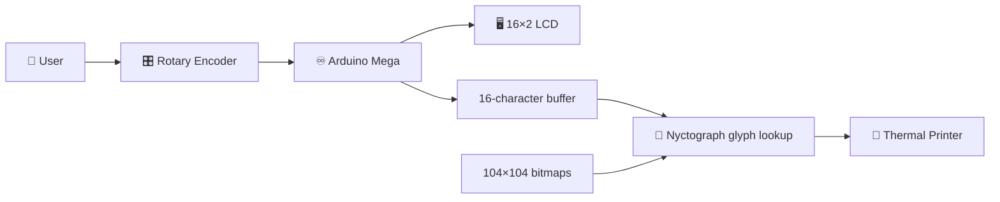
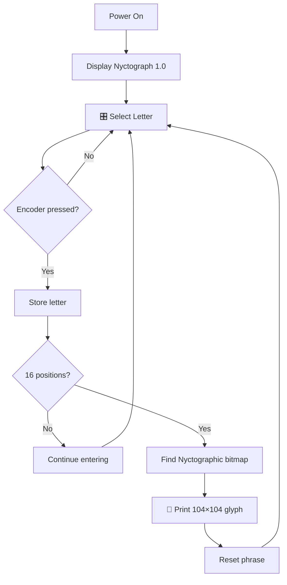

# 🌙 The Nyctograph Machine

### Arduino thermal printer for Lewis Carroll's alphabet for writing in the dark

[](https://docs.arduino.cc/hardware/mega-2560/)
[](https://learn.adafruit.com/mini-thermal-receipt-printer)
[](https://github.com/ronibandini/nyctograph#license)

**Roni Bandini — Buenos Aires, Argentina — May 2021**

**The Nyctograph Machine** is an Arduino-powered device that translates ordinary alphabetic text into **Lewis Carroll's Nyctographic Square Alphabet** and prints the resulting symbols on thermal paper.

A rotary encoder is used to select letters on a 16×2 LCD. After entering a 16-character phrase, the Arduino replaces each character with its corresponding **104×104 pixel nyctographic bitmap** and sends the sequence to a thermal printer.

The project combines Victorian writing technology, substitution alphabets, Arduino electronics and physical printing.

---

## ✨ Features

* 🌙 Lewis Carroll Nyctographic alphabet
* ♾️ Arduino Mega 2560
* 🎛️ Rotary encoder text input
* 🖥️ 16×2 I²C LCD
* 🧾 Thermal printer output
* 🔡 26 bitmap glyphs stored in flash
* 🖼️ 104×104 pixel / 1-bit symbols
* ✍️ 16-character phrase input
* 💡 Status LEDs
* 🧪 Alphabet test-print mode
* 📕 PDF user's guide included
* 🧱 Custom 3D-printable enclosure

---

# 🏗️ Architecture



The complete alphabet is stored locally inside the Arduino firmware. No computer or network connection is required during operation.

---

# 🌙 What Is a Nyctograph?

Lewis Carroll — Charles Lutwidge Dodgson — developed the **Nyctograph** in **1891** as a way to record ideas while lying in bed without having to light a candle.

He created a small writing guide based on square cells and developed a corresponding alphabet made from dots and strokes.

The common visual rule is a prominent dot in the **upper-left corner** of each letter symbol, helping identify the beginning of each character.

Carroll recorded the invention on **September 24, 1891** and described it publicly in a letter published in *The Lady* on **October 29, 1891**.

Historical reference:

👉 **[Alice's Adventures in Carroll's Own Square Alphabet — Lewis Carroll Society of North America](https://www.lewiscarroll.org/2012/02/07/alices-adventures-in-carrolls-own-square-alphabet/)**

---

# 🔄 This Machine

The original Nyctograph was designed to help a person **write** without seeing.

This project reverses the direction:

```text
Conventional alphabet
        ↓
Arduino
        ↓
Nyctographic alphabet
        ↓
Thermal paper
```

Instead of manually encoding each letter, the Arduino performs the substitution automatically.

---

# 🎛️ Text Entry

The firmware contains:

```cpp
static char letters[27] =
    " ABCDEFGHIJKLMNOPQRSTUVWXYZ";

char phrase[16] = "";
```

The rotary encoder moves through the alphabet:

```cpp
if (digitalRead(outputB) != aState) {
    counter++;

    if (counter > 26)
        counter = 26;
}
else {
    counter--;

    if (counter < 0)
        counter = 0;
}
```

The selected character appears on the LCD.

Pressing the encoder button stores its numeric index:

```cpp
phrase[index] = counter;

index = index + 1;

counter = 0;
```

---

# 🔢 Why 16 Characters?

The main phrase buffer is:

```cpp
char phrase[16] = "";
```

The interface also uses a:

```cpp
LiquidCrystal_I2C lcd(
    0x3F,
    16,
    2
);
```

After sixteen positions have been entered:

```cpp
if (index > 15) {
```

the machine begins printing the encoded phrase.

The original project also references the sixteen-cell format associated with Carroll's writing system and the conveniently sixteen-character phrases:

```text
THE WHITE RABBIT
EL CONEJO BLANCO
```

---

# 🖼️ Nyctographic Alphabet

Each character was converted into a:

```text
104 × 104 pixel
1-bit bitmap
```

and stored in:

👉 **[`letters.h`](https://github.com/ronibandini/nyctograph/blob/main/letters.h)**

The glyph arrays use `PROGMEM`:

```cpp
static const uint8_t PROGMEM a[] = {
    ...
};

static const uint8_t PROGMEM b[] = {
    ...
};
```

This allows the large bitmap data to remain in program flash instead of occupying SRAM.

---

# 🧾 Thermal Printing

The machine uses the **Adafruit Thermal Printer library**:

```cpp
#include "Adafruit_Thermal.h"
#include "SoftwareSerial.h"
```

Serial configuration:

```cpp
#define TX_PIN 12
#define RX_PIN 11

SoftwareSerial mySerial(
    RX_PIN,
    TX_PIN
);

Adafruit_Thermal printer(
    &mySerial
);
```

Printer serial speed:

```cpp
mySerial.begin(19200);
```

Each symbol is printed as a bitmap:

```cpp
printer.printBitmap(
    104,
    104,
    a
);

printer.println(F(""));
```

Official documentation:

👉 **[Adafruit Mini Thermal Receipt Printer Guide](https://learn.adafruit.com/mini-thermal-receipt-printer)**

👉 **[Adafruit Thermal Printer Library](https://github.com/adafruit/Adafruit-Thermal-Printer-Library)**

---

# 🔄 Complete Runtime Flow



---

# 🧪 Alphabet Test Mode

The firmware includes a test-print function.

Default:

```cpp
int alphaPrint = 0;
```

Change to:

```cpp
int alphaPrint = 1;
```

to activate the alphabet printing routine at startup.

This is useful for checking the bitmap conversion, thermal-printer connection and print quality.

---

# 💡 Status LEDs

Two LEDs are configured:

```cpp
#define ledA 8
#define ledB 9
```

They are used to indicate startup, debug printing and normal printing activity.

---

# 🔌 Connections

| Component           | Arduino Mega |
| ------------------- | ------------ |
| LCD SDA             | A4           |
| LCD SCL             | A5           |
| Printer RX / Yellow | D12          |
| Printer TX / Green  | D11          |
| Encoder button      | D5           |
| Encoder A           | D6           |
| Encoder B           | D7           |
| LED A               | D8           |
| LED B               | D9           |

Firmware definitions:

```cpp
#define outputA 6
#define outputB 7
#define buttonA 5

#define ledA 8
#define ledB 9
```

The encoder button uses:

```cpp
pinMode(
    buttonA,
    INPUT_PULLUP
);
```

---

# 🛠️ Hardware

| Component                                                         | Quantity |
| ----------------------------------------------------------------- | -------: |
| [Arduino Mega 2560](https://docs.arduino.cc/hardware/mega-2560/)  |        1 |
| Thermal receipt printer                                           |        1 |
| 16×2 I²C LCD                                                      |        1 |
| Rotary encoder with push button                                   |        1 |
| LED                                                               |        2 |
| Main switch                                                       |        1 |
| Power supply                                                      |        1 |
| Thermal paper                                                     |   1 roll |
| [3D-printed enclosure](https://www.thingiverse.com/thing:4869383) |        1 |

The first prototype used an Arduino Nano, but storing the full bitmap alphabet exceeded the available program-memory resources, so the final machine moved to the **Arduino Mega 2560**.

The Mega provides an ATmega2560, 16 MHz clock and substantially more flash memory.

👉 **[Arduino Mega 2560 Documentation](https://docs.arduino.cc/hardware/mega-2560/)**

---

# 📚 Required Libraries

The sketch uses:

```cpp
#include <Wire.h>
#include <LiquidCrystal_I2C.h>
#include "Adafruit_Thermal.h"
#include "SoftwareSerial.h"
#include "letters.h"
```

### Adafruit Thermal

👉 **[Adafruit Thermal Printer Library](https://github.com/adafruit/Adafruit-Thermal-Printer-Library)**

### LiquidCrystal_I2C

Install a compatible `LiquidCrystal_I2C` library through the Arduino Library Manager.

### Wire

Included with Arduino.

### SoftwareSerial

Included with the AVR Arduino core.

---

# 🚀 Installation

## 1. Install Arduino IDE

👉 **[Download Arduino IDE](https://www.arduino.cc/en/software)**

## 2. Install Mega Support

Install:

```text
Arduino AVR Boards
```

and select:

```text
Arduino Mega or Mega 2560
```

## 3. Clone the Repository

```bash
git clone https://github.com/ronibandini/nyctograph.git
cd nyctograph
```

Repository:

👉 **[github.com/ronibandini/nyctograph](https://github.com/ronibandini/nyctograph)**

## 4. Install Libraries

Install:

* `LiquidCrystal_I2C`
* `Adafruit Thermal Printer`

## 5. Upload

Open:

👉 **[`nyctograph7.ino`](https://github.com/ronibandini/nyctograph/blob/main/nyctograph7.ino)**

Compile and upload to the Arduino Mega.

Serial Monitor:

```text
9600 baud
```

The printer itself communicates at:

```text
19200 baud
```

Startup LCD:

```text
Nyctograph 1.0
Roni Bandini
```

---

# 📕 User Guide

The repository includes the original PDF manual:

👉 **[`Nyctograph.pdf`](https://github.com/ronibandini/nyctograph/blob/main/Nyctograph.pdf)**

It can be used as a compact reference for the machine and its alphabet.

---

# 🧱 3D-Printed Enclosure

The custom case was modeled to integrate:

* Arduino Mega
* Thermal printer
* LCD
* Rotary encoder
* LEDs
* Power electronics

Printable model:

👉 **[Nyctograph — Thingiverse](https://www.thingiverse.com/thing:4869383)**

The original build was designed in:

👉 **[Autodesk Fusion](https://www.autodesk.com/products/fusion-360/overview)**

---

# 🎥 Demo

▶️ **[Nyctograph Machine Demo — YouTube](https://www.youtube.com/watch?v=_4FAVR2nZ6M)**

---

# 📁 Repository Structure

```text
nyctograph/
│
├── nyctograph7.ino
├── letters.h
├── Nyctograph.pdf
└── README.md
```

* ⚙️ **[`nyctograph7.ino`](https://github.com/ronibandini/nyctograph/blob/main/nyctograph7.ino)** — main Arduino firmware
* 🔡 **[`letters.h`](https://github.com/ronibandini/nyctograph/blob/main/letters.h)** — nyctographic bitmap alphabet
* 📕 **[`Nyctograph.pdf`](https://github.com/ronibandini/nyctograph/blob/main/Nyctograph.pdf)** — user's guide
* 📖 **[`README.md`](https://github.com/ronibandini/nyctograph/blob/main/README.md)** — original repository documentation

---

# 🌐 External References

## 🛠️ Hackster.io

Complete original build article including the electronics, bitmap conversion, rotary interface, enclosure and thermal-printer setup.

👉 **[The Nyctograph Machine — Hackster.io](https://www.hackster.io/roni-bandini/the-nyctograph-machine-09212e)**

---

## 📚 Lewis Carroll Society of North America

Historical background on Carroll's original Nyctograph and Square Alphabet:

👉 **[Alice's Adventures in Carroll's Own Square Alphabet](https://www.lewiscarroll.org/2012/02/07/alices-adventures-in-carrolls-own-square-alphabet/)**

---

## ♾️ Arduino

Current hardware documentation:

👉 **[Arduino Mega 2560 Rev3](https://docs.arduino.cc/hardware/mega-2560/)**

---

## 🧾 Adafruit

Thermal-printer setup, serial communication and bitmap printing:

👉 **[Mini Thermal Receipt Printer Guide](https://learn.adafruit.com/mini-thermal-receipt-printer)**

👉 **[Bitmap / Arduino Printer Documentation](https://learn.adafruit.com/mini-thermal-receipt-printer/microcontroller)**

---

## 📰 Additional Coverage

Project overview published shortly after the original release:

👉 **[The Nyctograph Machine — jpralves.net](https://z.jpralves.net/post/2021/05/27/the-nyctograph-machine.html)**

---

# 🔗 Related GitHub Projects

### 📚 Raymond Roussel Reading Machine

Arduino-controlled literary reading machine based on Juan Esteban Fassio's interpretation of Raymond Roussel.

👉 **[github.com/ronibandini/RousselReadingMachine](https://github.com/ronibandini/RousselReadingMachine)**

### 📖 Haiku Reader

A dedicated eInk device designed specifically for reading haiku.

👉 **[github.com/ronibandini/haikureader](https://github.com/ronibandini/haikureader)**

### 📰 Hunter S. Thompson ASCII

Raspberry Pi literary installation combining animated writing and ASCII portraits.

👉 **[github.com/ronibandini/HunterSThompsonAscii](https://github.com/ronibandini/HunterSThompsonAscii)**

### 💳 MIFARE Poetry

Literary experiment using NFC cards as physical containers for micropoetry.

👉 **[github.com/ronibandini/MIFAREPoetry](https://github.com/ronibandini/MIFAREPoetry)**

### 👁️ Furby Borges

A 1998 Furby rebuilt as a Jorge Luis Borges animatronic.

👉 **[github.com/ronibandini/furby](https://github.com/ronibandini/furby)**

---

# 📕 Contracultura Maker

**Contracultura Maker** is a book by Roni Bandini about maker culture, experimental electronics, AI, physical computing and technological autonomy.

📂 **[Contracultura Maker — GitHub repository](https://github.com/ronibandini/ContraculturaMaker)**

📕 **[Download Contracultura Maker PDF](https://github.com/ronibandini/ContraculturaMaker/raw/refs/heads/main/ContraculturaMaker2.pdf)**

---

# 📬 Contact

**Roni Bandini**
Maker · AI Developer · Writer
Buenos Aires, Argentina

* 🐙 [GitHub — @ronibandini](https://github.com/ronibandini)
* 🌐 [Medium — @ronibandini](https://bandini.medium.com/)
* 𝕏 [X / Twitter — @RoniBandini](https://x.com/RoniBandini)
* 📸 [Instagram — @ronibandini](https://www.instagram.com/ronibandini/)
* ▶️ [YouTube — @RoniBandini](https://www.youtube.com/@RoniBandini)
* 💼 [LinkedIn — Roni Bandini](https://www.linkedin.com/in/ronibandini/)

---

Built with 🌙 + literature + Arduino + thermal paper.
